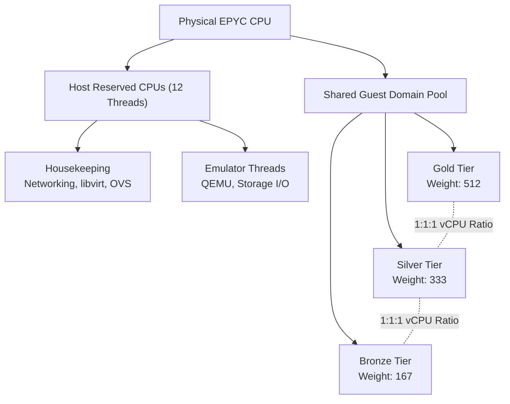
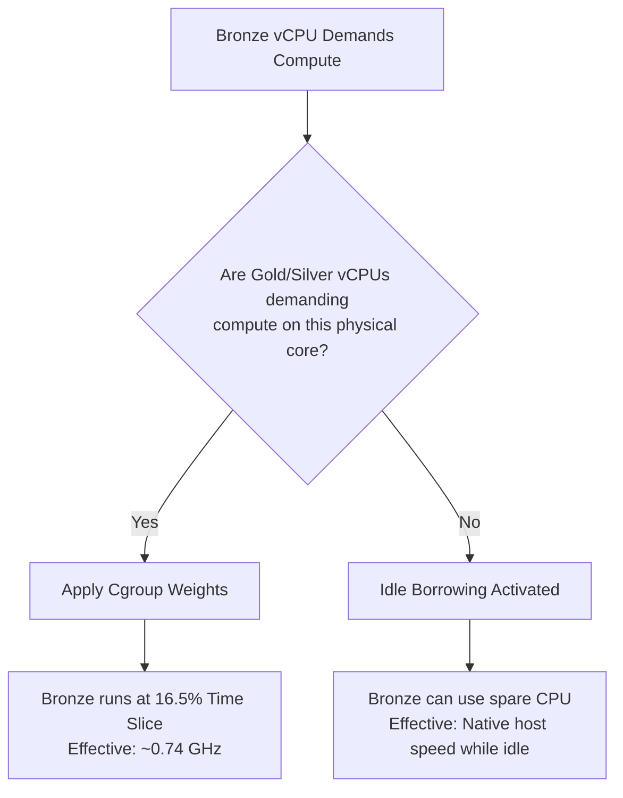

# Deterministic Density

**A practical reflection on deterministic virtualization, cgroup tiering, and why symmetric Gold/Silver/Bronze capacity changes the density conversation.**

<a href="https://gprocunier.github.io/deterministic-density/"><kbd>&nbsp;&nbsp;OPEN THE ESSAY&nbsp;&nbsp;</kbd></a>
<a href="https://github.com/gprocunier/openstack-cgroup-tiering"><kbd>&nbsp;&nbsp;CGROUP THESIS&nbsp;&nbsp;</kbd></a>
<a href="https://gprocunier.github.io/calabi/host-resource-management.html"><kbd>&nbsp;&nbsp;CALABI PROJECT&nbsp;&nbsp;</kbd></a>

---

# Deterministic Virtualization: Rethinking CPU Architecture with Cgroup Tiering

**A Practical Reflection on My Calabi and OpenStack Cgroup-Tiering Models**

When I think about how we used to size virtualization hosts, the pattern was simple: buy the fastest, biggest CPU the budget could tolerate, drop everything into one pool, and hope the noisy neighbors stayed quiet.

My cgroup-tiering idea, first described in my [2025 OpenStack cgroup-tiering thesis](https://github.com/gprocunier/openstack-cgroup-tiering) and later adapted for single-host KVM/OpenShift in my [Calabi project](https://gprocunier.github.io/calabi/host-resource-management.html), changes that starting point. I read it as a symmetric tier model, where the useful capacity comes from equal Gold, Silver, and Bronze slices instead of from squeezing every last vCPU into a flat pool.

Before that chip comparison makes sense, the tiering model needs a little context. When I compare processors like the AMD EPYC 9655 and the EPYC 9575F under this model, I care less about raw throughput and more about how large a symmetric guest pool each chip can support while keeping the Gold/Silver/Bronze balance intact.

---

## 1. The Density Paradigm: Traditional Virtualization vs. Guardrail Tiering

To explain why this matters, I start with the old habit of treating a host as a single pile of CPU time, then compare it with the tiered model.

### The Traditional Approach: Flat Pools and Hardware Silos

In a standard virtualization host, the "noisy neighbor" problem is a constant, unmanaged threat. The hypervisor's default scheduler treats all guest threads relatively equally. If a developer runs an unoptimized script that pegs the CPU at 100%, the hypervisor will happily steal execution time from a mission-critical production database to serve the developer's script. 

Because running mixed environments (Production and Non-Production) on a flat host is a bad default, traditional best practices tend to favor defensive design. I treat `1.5:1` as a conservative midpoint between published guidance from [VMware VCF](https://blogs.vmware.com/cloud-foundation/2025/06/04/vcpu-to-pcpu-ratio-guidelines/), [Microsoft Hyper-V](https://learn.microsoft.com/en-us/biztalk/technical-guides/checklist-optimizing-performance-on-hyper-v), and [Nutanix AHV](https://www.nutanix.com/tech-center/blog/understanding-cpu-resource-management-in-nutanix-ahv): VMware says there is no single right ratio and that `1:1` is the safe starting point when quick response matters, Microsoft says `1:1` is best for CPU-intensive workloads, and Nutanix says latency-sensitive workloads should stay at no oversubscription or up to `2x`, while non-critical workloads may go higher.

1. **Physical Segregation:** Organizations build entirely separate hardware silos (e.g., a "Prod Cluster" and a "Dev Cluster"). 
2. **Defensive Sizing:** Production workloads are rarely oversubscribed. To guarantee latency, Prod VMs are often provisioned at a 1:1 or strictly managed 1.5:1 ratio across the board to prevent contention.
3. **The Result:** Massive amounts of stranded, wasted compute. Production servers sit at 15% average utilization, wasting 85% of their hardware capacity just to maintain enough headroom for brief, unpredictable traffic spikes.

### The Tiered Approach: Mixed Tenancy and Consolidation

The Calabi/cgroup-tiering model addresses the noisy neighbor problem structurally. It keeps one tier from taking over the whole shared pool when the other tiers are also runnable.

**The Density Uplift:** Because the model is symmetric, mixed tenancy becomes practical. I can put CPU-bound non-production workloads beside latency-sensitive production workloads on the same host as long as the Gold/Silver/Bronze allocation stays balanced and the vendor-style baseline is kept conservative.

* Instead of running a Prod host at 15% utilization and a Dev host at 80% utilization, you combine them. 
* The host average utilization climbs by reclaiming stranded headroom from the silos.
* The blended host can safely run at a deterministic **3:1 symmetric oversubscription ratio** across the three tiers.

What I like about that arrangement is that it turns stranded production idle time into useful development throughput without making the tier ratios chaotic.

---

## 2. The Foundation: Strict Isolation and Symmetric Tiering

To make this density work, the Calabi model still depends on isolation. If the hypervisor competes with the guests for physical CPU cycles, the whole setup gets noisy fast. So I reserve a fixed slice of logical threads, for example 12 threads, for the host OS and emulators, and treat the rest as the shared guest pool.

Once I am inside the shared guest pool, the model avoids thread mobbing through **Symmetric Tiering**. Capacity comes from an equal partition of that pool across Gold, Silver, and Bronze, and the weights only decide how those equal slices behave under contention. The main planning risk is asymmetric demand, because if Gold fills faster than Silver or Bronze, the unused capacity in those tiers does not automatically become useful Gold capacity.

### Conceptual Flow: Host Architecture and Tiering

---

## 3. Effective Constrained Clock (ECC) and The SLA Floor

At full saturation, the cgroup weights (512 for Gold, 333 for Silver, 167 for Bronze) shape Linux Completely Fair Scheduler behavior. If the runnable work is evenly represented across the three tiers, Gold gets about **50.6%** of the physical core's time, Silver gets **32.9%**, and Bronze gets **16.5%**.

When I translate those percentages into clock speed, I get the **Effective Constrained Clock (ECC)**. Roughly half of a 4.5 GHz all-core boost clock works out to about 2.28 GHz of sustained execution under contention.

### The Worst-Case Contention SLA

| Tier       | Time Slice | EPYC 9575F (4.5 GHz All-Core Boost) | EPYC 9655 (4.1 GHz All-Core Boost) |
|:---------- |:---------- |:----------------------------------- |:---------------------------------- |
| **Gold**   | ~50.6%     | **~2.28 GHz**                       | ~2.07 GHz                          |
| **Silver** | ~32.9%     | **~1.48 GHz**                       | ~1.35 GHz                          |
| **Bronze** | ~16.5%     | **~0.74 GHz**                       | ~0.68 GHz                          |

That does sound low, but the point is that it is a contention floor, not a boost target. The actual experience still depends on the workload mix, but the tier model keeps the service curve predictable. For context, that is a different world from the 2016 era, when a flagship enterprise CPU like the Xeon E5-2699 v4 sat around a 2.2 GHz base clock and people already treated that as decent headroom.

---

## 4. Map Latency Tolerance, Not Environments

A common mistake is to map environments directly to tiers, for example, "Production is Gold, Development is Bronze." I do not think that works well. I map tiers based on the workload's tolerance for latency, not on the environment label.

* **Gold (Synchronous/Interactive):** Anything a human or live API is actively waiting on.
  
  * *Prod:* Kubernetes Masters (`etcd`), primary transactional databases, real-time auth.
  * *Dev:* Active developer VDI workspaces, interactive debuggers, "inner-loop" code compilation.

* **Silver (Asynchronous/Infrastructure):** Highly available but fundamentally asynchronous or heavily cached.
  
  * *Prod:* Ingress routers, Observability (Prometheus/Grafana), Message Brokers (Kafka), Software-Defined Storage (Ceph).
  * *Dev:* Staging control planes, internal Identity/DNS servers.

* **Bronze (Deferrable/Batch):** Background jobs where execution time is flexible.
  
  * *Prod:* Data warehousing (ETL), async email/PDF rendering, log archival.
  * *Dev:* Nightly automated test suites, CI/CD PR runners, static code analysis.

Because of the cgroup weights, a Bronze background job cannot dominate the shared pool when Gold and Silver are also runnable. That is the property I care about.

---

## 5. The "Sweet Spot" and Idle Borrowing

The ECC floors represent the contention case. The cgroup weights only matter when there is a scheduler queue. If Gold and Silver VMs are idle, the Bronze tier can use the spare CPU through **Idle Borrowing**.

### Conceptual Flow: CFS Idle Borrowing Logic

To keep that steady state, I would plan for Gold and Silver to leave enough average headroom for Bronze to borrow when the higher tiers are idle.

---

## 6. Capacity Planning: Traditional vs. Tiered Density

To compare the economics, I set a traditional flat-pool host beside the Calabi symmetric tiered model. In the tiered case, capacity comes from equal Gold, Silver, and Bronze slices, so the host ceiling is the symmetric guest pool rather than the most aggressive single-tier packing.

*(Note: Guest pools calculated after reserving 12 host threads for the hypervisor: 9575F = 116 threads; 9655 = 180 threads.)*

### Scenario A: T-Shirt Sizing (Optimal Density Stacking)

In [Howard Young's summary of Zadara's 2024 VM sampling](https://www.linkedin.com/pulse/size-matters-cloud-vm-statistics-tech-stack-tuesday-howard-young-77rff), 60.8% of the sample is 2 vCPU, 24.2% is 4 vCPU, and 10.1% is 8 vCPU. That is close enough to a plain 60/30/10 split for this comparison. The table below uses exact 10-VM packs in that ratio: 6 x 2-vCPU, 3 x 4-vCPU, and 1 x 8-vCPU, or 32 vCPU per pack.

**EPYC 9575F**

| Mix Component     | 1:1    | 1.5:1  | 3:1 tiered |
|:----------------- |:------ |:------ |:---------- |
| **2-vCPU VMs**    | 18     | 30     | 60         |
| **4-vCPU VMs**    | 9      | 15     | 30         |
| **8-vCPU VMs**    | 3      | 5      | 10         |
| **Total VMs**     | **30** | **50** | **100**    |
| **Gain vs 1:1**   | N/A    | 1.67x  | **3.33x**  |
| **vCPU consumed** | 96     | 160    | 320        |
| **Reserve/slack** | 20     | 14     | 28         |

**EPYC 9655**

| Mix Component     | 1:1    | 1.5:1  | 3:1 tiered |
|:----------------- |:------ |:------ |:---------- |
| **2-vCPU VMs**    | 30     | 48     | 96         |
| **4-vCPU VMs**    | 15     | 24     | 48         |
| **8-vCPU VMs**    | 5      | 8      | 16         |
| **Total VMs**     | **50** | **80** | **160**    |
| **Gain vs 1:1**   | N/A    | 1.60x  | **3.20x**  |
| **vCPU consumed** | 160    | 256    | 512        |
| **Reserve/slack** | 20     | 14     | 28         |

> [!NOTE]
> The 9655 shows slightly less relative gain than the 9575F because its strict `1:1` baseline is already stronger. The absolute outcome is still better on the 9655, but the percentage uplift compresses because the denominator is larger.

**Value:** On this 60/30/10 small-instance mix, the `1.5:1` flat-pool midpoint already gives a visible lift over strict `1:1`, but the tiered model is where the step-change appears. The 9575F moves from 30 mixed-size VMs at `1:1` to 50 at `1.5:1` and 100 in the tiered model, while the 9655 moves from 50 to 80 to 160. I would treat the leftover vCPU in each column as intentional reserve for host housekeeping, QEMU emulator threads, IOThreads, and small mix skew, not as accidental waste.

### Scenario B: OpenShift Estate and Orthogonal Tenancy

Consider a primary OpenShift estate shaped like this:

* **Gold:** 3 masters, 24 vCPU total (8 vCPU each)
* **Silver:** 3 infra VMs, 24 vCPU total: 10 vCPU for [OpenShift Data Foundation](https://docs.redhat.com/en/documentation/red_hat_openshift_data_foundation/4.10/html/planning_your_deployment/infrastructure-requirements_rhodf), 4 vCPU for [Red Hat Ansible Automation Platform](https://docs.redhat.com/en/documentation/red_hat_ansible_automation_platform/2.4/html-single/red_hat_ansible_automation_platform_installation_guide/red_hat_ansible_automation_platform_installation_guide), and 10 vCPU for [OpenShift Logging](https://docs.redhat.com/en/documentation/openshift_container_platform/4.10/html/logging/configuring-your-logging-deployment) plus [Red Hat build of Keycloak](https://docs.redhat.com/en/documentation/red_hat_build_of_keycloak/26.4/html-single/high_availability_guide/)
* **Bronze:** 3 standard workers, 24 vCPU total (8 vCPU each)

That makes the primary estate a 72-vCPU footprint before any second tenant is added.

**EPYC 9575F**

| Capacity After Primary Estate    | 1:1                              | 1.5:1                           | 3:1 tiered                       |
|:-------------------------------- |:-------------------------------- |:------------------------------- |:-------------------------------- |
| **vCPU remaining**               | 44                               | 102                             | 276                              |
| **Tenant slots** *(2 vCPU each)* | 22                               | 51                              | 138                              |
| **Additional 72-vCPU estates**   | 0 full estates + slack (44 vCPU) | 1 full estate + slack (30 vCPU) | 3 full estates + slack (60 vCPU) |
| **Gain vs 1:1**                  | N/A                              | 2.32x                           | **6.27x**                        |
| **Gain vs 1.5:1**                | N/A                              | N/A                             | **2.71x**                        |

**EPYC 9655**

| Capacity After Primary Estate    | 1:1                             | 1.5:1                            | 3:1 tiered                       |
|:-------------------------------- |:------------------------------- |:-------------------------------- |:-------------------------------- |
| **vCPU remaining**               | 108                             | 198                              | 468                              |
| **Tenant slots** *(2 vCPU each)* | 54                              | 99                               | 234                              |
| **Additional 72-vCPU estates**   | 1 full estate + slack (36 vCPU) | 2 full estates + slack (54 vCPU) | 6 full estates + slack (36 vCPU) |
| **Gain vs 1:1**                  | N/A                             | 1.83x                            | **4.33x**                        |
| **Gain vs 1.5:1**                | N/A                             | N/A                              | **2.36x**                        |

**Value:** The `1:1` columns are the control case, and the primary `72-vCPU` estate fits on both chips. The difference is what remains after that first estate is in place: on the 9575F, `1:1` leaves only `44 vCPU`, which is not enough for a second full estate, while the 9655 can fit one more. The `1.5:1` midpoint moves those chips to one and two additional estates. The tiered model moves them to three and six. That is the practical tenancy jump: not a marginal improvement in worker count, but a host that can absorb whole additional clusters without abandoning predictable service tiers.

---

## Conclusion: Density vs. Baseline SLA Guarantees

My read is that the Calabi and OpenStack cgroup-tiering models I wrote work well as long as the symmetric tier constraint is respected. Compared with the conservative oversubscription assumptions many teams used in the 2016 era, the same chassis can absorb a much larger workload mix without giving up the SLA floor. For me, `1.5:1` is a midpoint, not a universal rule, because it sits between VMware's `1:1` starting point and Nutanix's `2x` upper bound for latency-sensitive workloads. I think that is the practical gain here: legacy flat pools give way to a denser host without losing the ability to reason about the tiers.

Choosing the right silicon to drive this model requires an honest assessment of the organization's worst-case scenario:

* **Choose the AMD EPYC 9655 if density and throughput matter most.** It gives better hardware ROI and more symmetric guest capacity for CI/CD and worker nodes.
* **Choose the AMD EPYC 9575F if you want more per-core headroom.** You pay more per symmetric slot, but you get a faster CPU baseline for workloads that are sensitive to contention floors.
